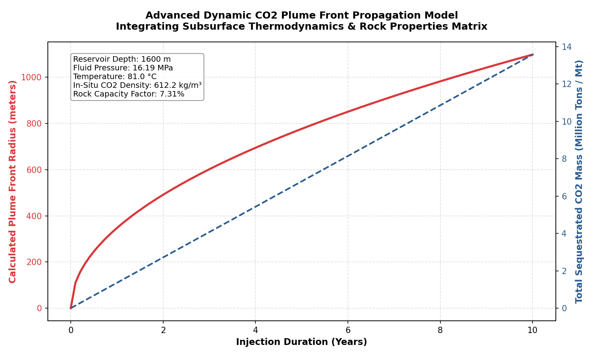
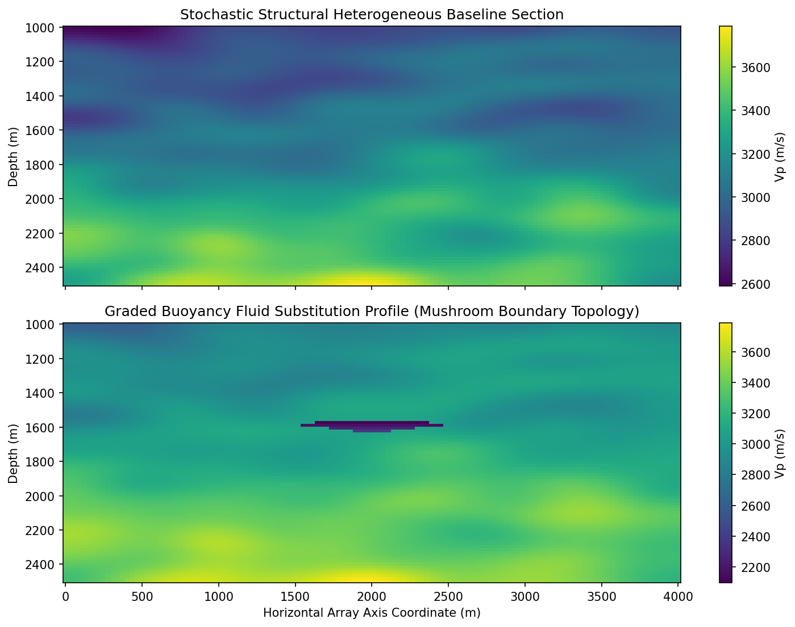
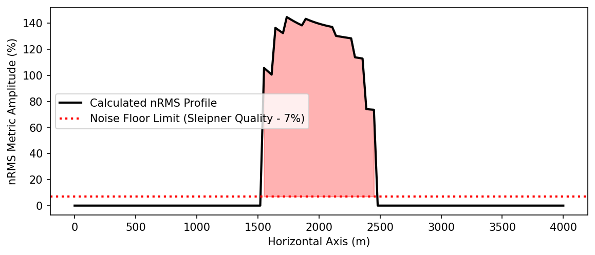

# CCS Monitoring & Simulation
**Carbon Capture and Storage (CCS) monitoring tools built in Python** Based on 4D seismic simulation research — Matindok Gas Field, Central Sulawesi

---

## 📌 Background
This project digitizes and extends results from an undergraduate thesis on  
**CO₂ storage feasibility using 4D seismic monitoring** at the Matindok–Donggi–Senoro  
gas field complex, Central Sulawesi, Indonesia.

The study used Petrel to simulate compressional wave velocity ($V_p$) changes due to $\text{CO}_2$ injection into the Minahaki Carbonate Formation, now fully refactored into a modern, automated Python package layout.

---

## 🗂️ Modules & Package Structure

This project has been restructured into a modular `src/` package layout to cleanly isolate the core geophysical calculation engines from the presentation layer:

### 1. Central Site Presets (`src/ccs_monitoring/presets.py`)
Provides a centralized, literature-calibrated reservoir parameter matrix driven by a global selection menu:
- **Matindok (Thesis Reference)**: Minahaki Carbonate Formation, Central Sulawesi.
- **Sleipner Utsira (North Sea)**: Standard industrial sandstone aquifer benchmark.
- **Baltic Sea Yoldia (Aquifer)**: Regional deep sandstone layer optimized for patchy evaluation.

---

### 2. CO₂ Plume Growth Simulation (`src/ccs_monitoring/Plume/`)
Visualizes the lateral radial expansion footprint of the injected carbon mass over time.
- Driven by a fluid-dynamic gravity current power-law model ($t^{0.5}$).
- Features a **Porosity Uncertainty Band (±3%)** to map subsurface reservoir matrix variances.

**Output:**


---

### 3. 4D Seismic Vp Anomaly Visualizer (`src/ccs_monitoring/Seismic/`)
Generates 2D geological slice cross-sections displaying velocity responses post-fluid substitution.
- Implements a **Gaussian Random Field Texture** to mimic realistic geological background noise textures.
- Models a buoyancy-driven **mushroom-shaped CO₂ plume** framework natively synchronized across the suite.

**Output:**


---

### 4. Gassmann Fluid Substitution (`src/ccs_monitoring/Rock_physics/`)
Rock physics engine evaluating subsurface acoustic velocity shifts caused by carbon injection.
- Employs an **Exact Symbolic Inversion** derived via `sympy` to solve for dry rock modulus ($K_{dry}$) without fluid compressibility approximation errors.
- **Toggle Matrix Theory**: Selectable fluid mixing laws between Wood's Law (Uniform Saturation) and Brie's Empirical Law (Patchy Saturation).

**Output:**


---

### 5. Well Log Integration & Multi-Page Dashboard (`src/ccs_monitoring/Dashboard/`)
An interactive multi-page web application managing all modules via a unified, reactive sidebar radio navigation matrix.
- **LAS File Uploader**: Features a native `.las` wireline log parsing interface powered by `lasio`.
- Generates dynamic synthetic fallback proxy models automatically for seamless testing.

---

### 6. Anomaly Detection & Alerts (`src/ccs_monitoring/Anomaly/`)
Integrates core trace analytics and risk containment diagnostics to evaluate operational boundaries.
- **Zero-Mean Trace nRMS Profile**: Converts properties into a synthetic seismic trace via Reflection Coefficient convolution with a symmetric Ricker Wavelet to prevent detector sensitivity collapse.
- **Statistical Z-Score Deviation Field**: Isolates fluid migration anomalies from background geostatistical noise.

**Output:**


---

## 📥 Data Setup

The *Well Log Analysis* module dynamically reads custom user-supplied files. If you want to benchmark the system using the official Sleipner dataset from Equinor:

1. Go to: **https://co2datashare.org/dataset/sleipner-2019-benchmark-model**
2. Download **"Well data (2.1.2 - Well logs)"**
3. Extract the contents and use the **Upload** button directly inside the dashboard panel to submit your target `.las` file format.

---

## 🛠️ Tech Stack
| Tool | Purpose |
|---|---|
| Python 3.10+ | Core development framework |
| NumPy, SciPy | Numerical grid matrix computation |
| Matplotlib | Subsurface visualization and plotting |
| Streamlit | Interactive multi-page dashboard presentation layer |
| lasio | LAS wireline log file reader engine |
| PyTest | Automated physics regression testing |

---

## 🚀 How to Run

### 1. Provision Local Package (Editable Mode)
```bash
git clone [https://github.com/Arsyrahmatullah/ccs-monitoring.git](https://github.com/Arsyrahmatullah/ccs-monitoring.git)
cd ccs-monitoring/ccs-monitoring
pip install -e .