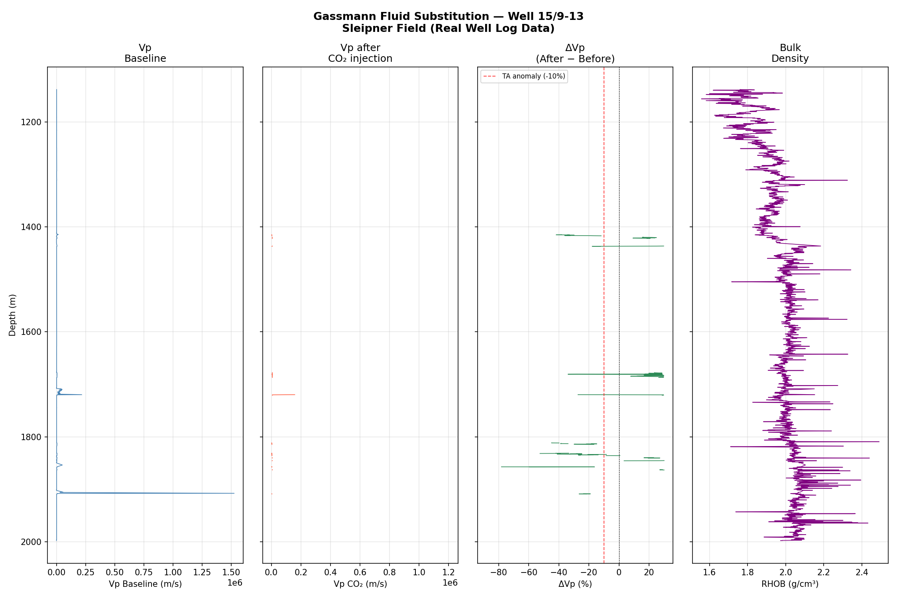

---

### 4. Gassmann Fluid Substitution (`Modul4_Gassmann/`)
Rock physics modeling of seismic velocity changes due to CO₂ injection.
- Fluid substitution: brine → supercritical CO₂ using Gassmann equation
- Wood's law for fluid mixing
- Output: Vp, Vs, and ΔVp vs CO₂ saturation curves

**Output:**


---

### 5. Real Data — Sleipner Well Log (`Modul5_RealData/`)
Gassmann fluid substitution applied to real well log data from Sleipner CCS field, Norway.
- Well: 15/9-13 (Sleipner 2019 Benchmark Dataset)
- Curves used: DT (sonic), RHOB (density), NPHI (porosity)
- Compares ΔVp from real data vs thesis assumption (-10%)

**Output:**


---

## 📥 Data Setup

Modul 5 requires well log data from the Sleipner field (not included due to Equinor license).  
Download for free at:

1. Go to **https://co2datashare.org/dataset/sleipner-2019-benchmark-model**
2. Download **"Well data (2.1.2 - Well logs)"**
3. Extract and place the `well_data/` folder inside the `ccs-monitoring/` directory

---

## 🛠️ Tech Stack
| Tool | Purpose |
|---|---|
| Python 3.14 | Core language |
| NumPy, SciPy | Numerical computing |
| Matplotlib | Visualization |
| Streamlit | Interactive dashboard |
| lasio | LAS well log file reader |

---

## 🚀 How to Run
```bash
```
git clone https://github.com/Arsyrahmatullah/ccs-monitoring.git
cd ccs-monitoring
pip install -r requirements.txt
python Modul1_Plume/plume_growth.py
```