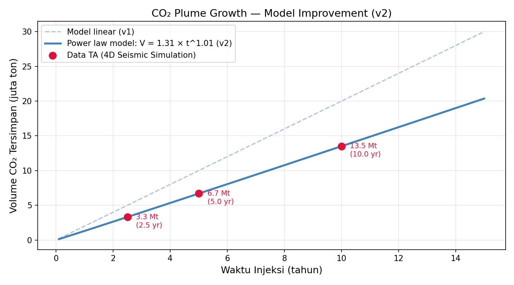

# CCS Monitoring & Simulation
**Carbon Capture and Storage (CCS) monitoring tools built in Python**  
Based on 4D seismic simulation research — Matindok Gas Field, Central Sulawesi

---

## 📌 Background
This project digitizes and extends results from an undergraduate thesis on  
**CO₂ storage feasibility using 4D seismic monitoring** at the Matindok–Donggi–Senoro  
gas field complex, Central Sulawesi, Indonesia.

The study used Petrel and NORSAR SeisWave to simulate compressional wave velocity (Vp)  
changes due to CO₂ injection into the Minahaki and Matindok formations.

---

## 🗂️ Modules

### 1. CO₂ Plume Growth Simulation (`Modul1_Plume/`)
Visualizes CO₂ storage volume over time based on thesis simulation data.
- Linear model vs power law model (v2)
- Injection rate: ~2 Mt/year
- Timeframe: 2.5, 5, and 10 years post-injection

**Output:**


---

### 2. 4D Seismic Vp Anomaly Visualizer (`Modul2_Vp_Anomali/`)
Visualizes Vp changes due to CO₂ injection as a cross-section.
- Formations: Minahaki (1400–1800m), Matindok (1800–2200m), Tomori (2200–2600m)
- Heterogeneous Vp gradient within each formation
- Mushroom-shaped CO₂ plume (buoyancy-driven)
- 3-panel: Baseline / After injection / 4D Difference

**Output:**


---

### 3. Streamlit Dashboard (`Modul3_Dashboard/`)
Interactive web dashboard combining all modules with adjustable parameters.
- Real-time plume growth simulation
- Interactive 4D seismic Vp anomaly visualizer
- Parameter sliders: injection rate, simulation duration, Vp anomaly
```bash
streamlit run Modul3_Dashboard/app.py
```

---

### 4. Gassmann Fluid Substitution (`Modul4_Gassmann/`)
Rock physics modeling of seismic velocity changes due to CO₂ injection.
- Fluid substitution: brine → supercritical CO₂ using Gassmann equation
- Wood's law for fluid mixing
- Output: Vp, Vs, and ΔVp vs CO₂ saturation curves

**Output:**


---

### 5. Real Data — Sleipner Well Log (`Modul5_RealData/`)
Gassmann fluid substitution applied to real well log data from Sleipner CCS field, Norway.
- Well: 15/9-13 (Sleipner 2019 Benchmark Dataset)
- Curves used: DT (sonic), RHOB (density), NPHI (porosity)
- Compares ΔVp from real data vs thesis assumption (-10%)

**Output:**


---

## 📥 Data Setup

Modul 5 requires well log data from the Sleipner field (not included due to Equinor license).  
Download for free at:

1. Go to **https://co2datashare.org/dataset/sleipner-2019-benchmark-model**
2. Download **"Well data (2.1.2 - Well logs)"**
3. Extract and place the `well_data/` folder inside the `ccs-monitoring/` directory

---

## 🛠️ Tech Stack
| Tool | Purpose |
|---|---|
| Python 3.14 | Core language |
| NumPy, SciPy | Numerical computing |
| Matplotlib | Visualization |
| Streamlit | Interactive dashboard |
| lasio | LAS well log file reader |

---

## 🚀 How to Run
```bash
git clone https://github.com/Arsyrahmatullah/ccs-monitoring.git
cd ccs-monitoring
pip install -r requirements.txt
python Modul1_Plume/plume_growth.py
```

---

## 📚 Reference
Thesis: *4D Seismic Monitoring Feasibility for CO₂ Storage in Matindok Field*  
Institut Teknologi Bandung — Teknik Geofisika