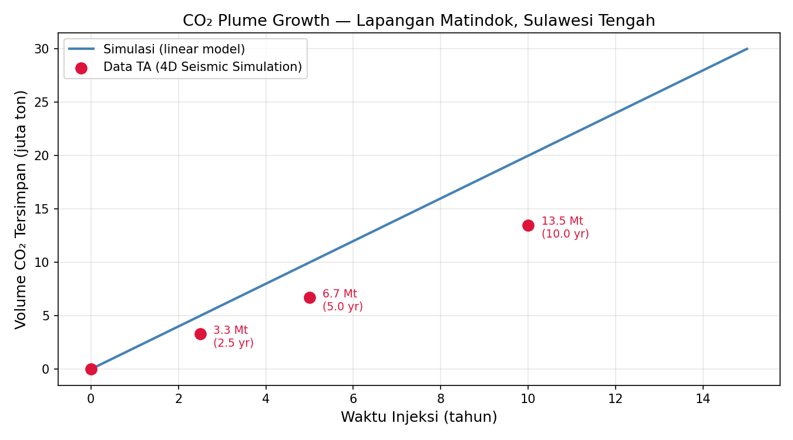
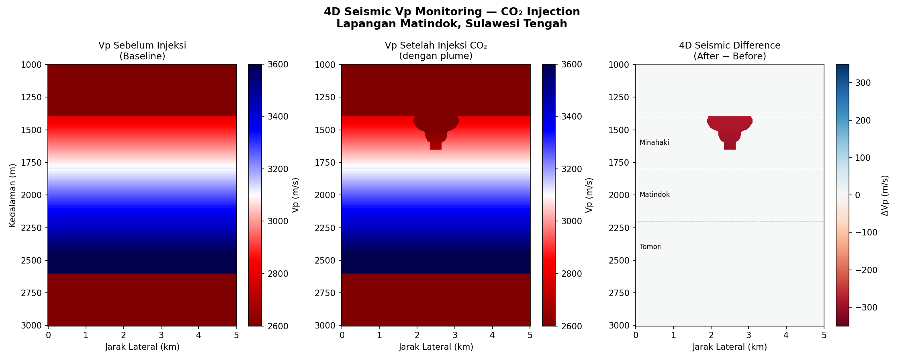
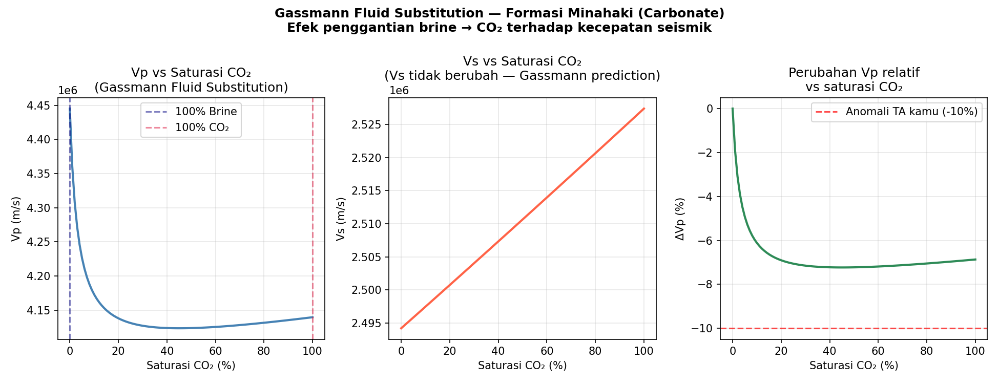

# CCS Monitoring & Simulation
**Carbon Capture and Storage (CCS) monitoring tools built in Python**  
Based on 4D seismic simulation research — Matindok Gas Field, Central Sulawesi

---

## 📌 Background
This project digitizes and extends results from an undergraduate thesis on  
**CO₂ storage feasibility using 4D seismic monitoring** at the Matindok–Donggi–Senoro  
gas field complex, Central Sulawesi, Indonesia.

The study used Petrel and NORSAR SeisWave to simulate compressional wave velocity (Vp)  
changes due to CO₂ injection into the Minahaki and Matindok formations.

---

## 🗂️ Modules

### 1. CO₂ Plume Growth Simulation (`plume_growth.py`)
Visualizes CO₂ storage volume over time based on thesis simulation data.
- Injection rate: ~2 Mt/year
- Reservoir: Minahaki & Matindok Formation
- Timeframe: 2.5, 5, and 10 years post-injection
**Output:**



### 2. 4D Seismic Vp Anomaly Visualizer (`Modul2_Vp_Anomali/vp_anomaly.py`)
Visualizes compressional wave velocity (Vp) changes due to CO₂ injection
using a synthetic cross-section model based on thesis parameters.
- Formations: Minahaki (1400–1800m), Matindok (1800–2200m), Tomori (2200–2600m)
- CO₂ plume effect: −10% Vp anomaly in injection zone
- Output: 3-panel 4D seismic difference plot (Before / After / Difference)

**Output:**


### 3. Streamlit Dashboard (`Modul3_Dashboard/app.py`)
Interactive web dashboard combining all modules with adjustable parameters.
- Real-time plume growth simulation
- Interactive 4D seismic Vp anomaly visualizer
- Parameter sliders: injection rate, simulation duration, Vp anomaly

### 4. Gassmann Fluid Substitution (`Modul4_Gassmann/gassmann.py`)
Rock physics modeling of seismic velocity changes due to CO₂ injection.
- Fluid substitution: brine → supercritical CO₂
- Wood's law for fluid mixing
- Output: Vp, Vs, and ΔVp vs CO₂ saturation curves

**Output:**


---

## 🛠️ Tech Stack
- Python 3.14
- NumPy, Matplotlib

---

## 🚀 How to Run
```bash
git clone https://github.com/Arsyrahmatullah/ccs-monitoring.git
cd ccs-monitoring
pip install numpy matplotlib
python plume_growth.py
```

---

## 📚 Reference
Thesis: *4D Seismic Monitoring Feasibility for CO₂ Storage in Matindok Field*  
Institut Teknologi Bandung — Teknik Geofisika